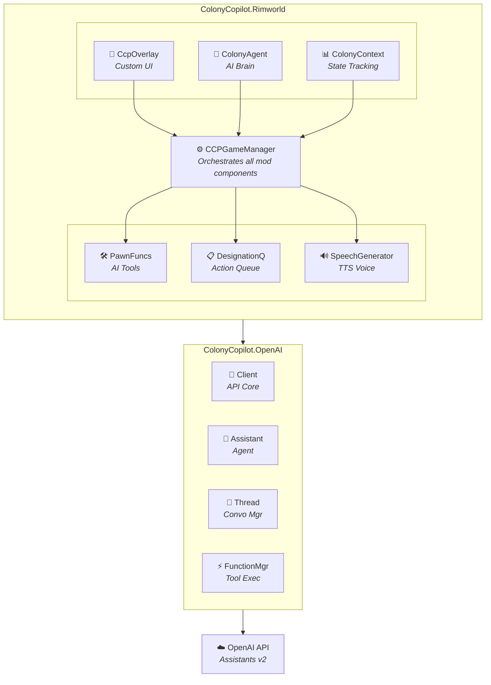

<p align="center">
  
</p>

<h1 align="center">ColonyCopilot</h1>

<p align="center">
  <strong>An Autonomous AI Agent for RimWorld</strong><br>
  Powered by OpenAI's Assistants API • Real-time Colony Management • Voice-Enabled Responses
</p>

<p align="center">
  
  
  
</p>

---

## 🌟 What is ColonyCopilot?

ColonyCopilot transforms RimWorld into a collaborative experience by embedding an **autonomous AI assistant** directly into your game. Unlike traditional mods that add content or tweak mechanics, ColonyCopilot introduces a living, thinking companion that can observe your colony, understand context, plan actions, and execute commands on your behalf.

**This isn't just a chatbot overlay.** ColonyCopilot is a fully realized AI agent that:
- 🧠 **Reasons** about your colony's current state (colonists, resources, threats)
- 🗣️ **Communicates** with synthesized voice responses
- ⚡ **Acts** by issuing in-game designations and commands
- 🔄 **Reacts** to changing conditions with contextual awareness

---

## 🏗️ Architecture Overview



---

## ✨ Key Features

### 🎨 Native UI Integration

ColonyCopilot renders its own UI layer directly within RimWorld using **Harmony patches** to intercept the game's rendering pipeline. No external windows, no overlays—just seamless integration.

```csharp
[HarmonyPatch(typeof(UIRoot_Play), "UIRootOnGUI")]
public class UIRoot_Play_UIRootOnGUI_Patch
{
    public static void Prefix() => CcpOverlay.Render();
}
```

The UI system includes:
- **Responsive text input** with enter-to-send functionality
- **Speech panel** that displays AI responses as they're spoken
- **Loading spinner** that animates while the AI processes requests
- **Toggle button** to show/hide the interface
- **Resolution-independent scaling** for all screen sizes

### 🤖 Complete OpenAI Client Implementation

Rather than relying on third-party libraries, ColonyCopilot implements a **custom OpenAI client** from the ground up, specifically designed for Unity's async patterns and RimWorld's threading model.

**Key Components:**

| Component | Purpose |
|-----------|---------|
| `Client` | Manages API authentication and model configuration |
| `Assistant` | Creates, updates, and manages OpenAI Assistants |
| `Thread` | Handles conversation state and message history |
| `Run` | Executes assistant responses and monitors status |
| `FunctionManager` | Discovers and executes AI-callable tools |

### 🛠️ Attribute-Based Function System

ColonyCopilot uses a powerful **reflection-based function discovery system** that automatically exposes C# methods as tools the AI can call. Simply decorate methods with attributes:

```csharp
[AIFunction("BuildRoom", "Creates a blueprint for colonists to construct.")]
public static string BuildRoom(
    [AIParameter("Name reflecting the room's purpose")] string name,
    [AIParameter("Size in tiles (1-11)")] int size,
    [AIParameter("Construction material")] ResourceChoice material,
    [AIParameter("Room type (Bedroom, Kitchen, etc.)")] RoomType roomType)
{
    // Implementation...
    return "[SUCCESS] Created room blueprint";
}
```

The `FunctionManager` automatically:
- Discovers all `[AIFunction]` decorated methods at startup
- Generates OpenAI-compatible JSON schemas
- Validates function signatures (static, returns string)
- Parses JSON arguments back into typed parameters
- Executes functions and returns results to the AI

### 🎯 Available AI Actions

| Function | Description |
|----------|-------------|
| `CreatePerson` | Spawn a new colonist with specified name and gender |
| `RequestMine` | Designate ore veins for mining (Steel, Gold, Uranium, etc.) |
| `BuildRoom` | Create room blueprints with materials and furniture |
| `RequestChopTree` | Designate trees for wood harvesting |

### 🧠 Intelligent Context System

The AI doesn't operate blindly. The `ColonyContext` class continuously tracks and summarizes:

**Colonist Status:**
- Names, ages, genders
- Current mood and health percentages  
- Rest levels
- Active tasks/jobs

**Resource Inventory:**
- All stored materials and quantities
- Available building materials

**Map Intelligence:**
- Ore deposits by type (Steel, Gold, Silver, Plasteel, Jade, Uranium)
- Tree counts and locations
- Existing room layouts

This context is serialized and injected into every AI request, allowing the agent to make informed decisions:

```
[Colonists]
Total Colonists: 3

[Individuals]
0. Sarah - Female - 24
- Faction: Player Colony
- Mood: Content
- Health: 100%
- Rest: 78%
- Current Activity: Hauling steel x75

[Ore found on Map]
Steel: 47
Gold: 12
Uranium: 3

[Resources In Storage]
Wood: 423
Steel: 156
...
```

### 🗣️ Voice Synthesis

ColonyCopilot doesn't just type responses—it **speaks them aloud** using OpenAI's text-to-speech API. The `SpeechGenerator` component:

- Converts AI responses to audio using the TTS-1 model
- Supports multiple voice options (Nova, Alloy, Echo, etc.)
- Plays audio through Unity's AudioSource system
- Displays text in a speech bubble while speaking

### ⚡ Thread-Safe Action Execution

RimWorld runs on Unity's main thread, but AI responses come from async operations. The `DesignationQueue` solves this elegantly:

```csharp
// AI thread queues action
DesignationQueue.AddDesignation(typeof(Designator_MineVein), positions);

// Main thread executes during GameComponentTick
public override void GameComponentTick()
{
    DesignationQueue.ExecuteDesignations();
}
```

This ensures all game modifications happen safely on the correct thread while maintaining responsive AI interactions.

---

## 🚀 Getting Started

### Prerequisites

- RimWorld 1.4 or later
- [Harmony](https://github.com/pardeike/Harmony) mod framework
- OpenAI API key with access to:
  - Assistants API
  - GPT-4 Turbo (or GPT-3.5 Turbo)
  - TTS-1 (for voice)

### Installation

1. Clone or download this repository
2. Place the `ColonyCopilot` folder in your RimWorld mods directory:
   - **Windows:** `C:\Program Files (x86)\Steam\steamapps\common\RimWorld\Mods\`
   - **macOS:** `~/Library/Application Support/Steam/steamapps/common/RimWorld/Mods/`
   - **Linux:** `~/.steam/steam/steamapps/common/RimWorld/Mods/`
3. Enable the mod in RimWorld's mod manager
4. Configure your API key in **Options → Mod Settings → Colony Copilot**

### Configuration

| Setting | Description |
|---------|-------------|
| **Enabled** | Toggle the mod on/off |
| **API Key** | Your OpenAI API key |
| **Model** | GPT model to use (gpt-4-turbo, gpt-3.5-turbo-16k, etc.) |

---

## 🎮 Usage

1. **Start a new game** or load an existing colony
2. The ColonyCopilot UI appears at the bottom of the screen
3. **Type a request** in the text input field
4. Press **Enter** or click the **➤** button to send
5. Watch the **spinner** while the AI thinks
6. **Listen** as the AI responds and see actions happen in-game

### Example Prompts

> "Build me a wooden bedroom for my colonists"

> "We're running low on steel, can you set up some mining?"

> "Create a storage room so we can organize our resources"

> "Chop down some trees, we need more wood"

---

## 🔧 Technical Deep-Dive

### The Agent Loop

When you send a message, here's what happens:

```
1. User types message → UI captures input
2. Message sent to ColonyAgent.SendUserMessage()
3. Colony context serialized and attached
4. Thread.GetResponse() initiates a Run
5. OpenAI processes and may request tool calls
6. FunctionManager executes requested tools
7. Tool outputs submitted back to OpenAI
8. Final response received
9. SpeechGenerator synthesizes audio
10. Response displayed and spoken
```

### OpenAI Assistants API Integration

ColonyCopilot leverages the **Assistants API v2**, which provides:

- **Persistent threads** for conversation continuity
- **Tool/function calling** for real-world actions
- **Instruction injection** for per-request context
- **Run management** for async processing

The implementation handles all edge cases:
- Run status polling with timeout protection
- Tool call execution and output submission
- Error recovery and graceful degradation
- Thread and assistant cleanup on game exit

---

## 📁 Project Structure

```
ColonyCopilot/
├── About/                      # Mod metadata and images
├── Assemblies/                 # Compiled DLLs
├── Source/
│   ├── ColonyCopilot.OpenAI/   # OpenAI API implementation
│   │   ├── Assistants/         # Assistant, Thread, Run, Message
│   │   ├── Functions/          # AIFunction, FunctionManager
│   │   ├── Web/                # HTTP request handling
│   │   └── Client.cs           # Core API client
│   │
│   ├── ColonyCopilot.Rimworld/ # RimWorld integration
│   │   ├── DataStructures/     # CCPRoom, RoomPresets
│   │   ├── ContextEnums/       # OreChoice, ResourceChoice, RoomType
│   │   ├── Extensions/         # Helper extensions
│   │   ├── CCPGameManager.cs   # Main orchestrator
│   │   ├── CcpOverlay.cs       # UI rendering
│   │   ├── ColonyAgent.cs      # AI agent wrapper
│   │   ├── ColonyContext.cs    # State tracking
│   │   ├── PawnFunctions.cs    # AI-callable tools
│   │   └── SpeechGenerator.cs  # TTS integration
│   │
│   └── ColonyCopilot.Tests/    # Unit tests
│
└── Textures/                   # UI assets
    ├── Copilot.png
    └── Spinner.png
```

---

## 🤝 Contributing

Contributions are welcome! Areas that could use help:

- **More AI functions** - Expand what the agent can do
- **Smarter context** - Better colony state summarization
- **Event reactions** - Agent responds to raids, mental breaks, etc.
- **Memory system** - Long-term knowledge persistence
- **Multi-agent** - Multiple AI personalities

---

## ⚠️ Important Notes

- **API costs apply** - OpenAI charges for API usage
- **Internet required** - The mod needs connectivity for AI features
- **Save game safe** - Mod can be added/removed without breaking saves
- **Performance** - AI calls are async and don't block gameplay

---

## 📜 License

This project is provided as-is for educational and entertainment purposes.

---

<p align="center">
  <em>Built with 🤖 for the RimWorld community</em>
</p>
